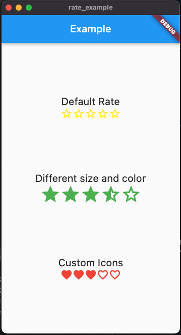
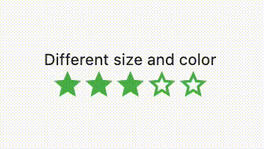

# Rate

A simple star rating compnent

## Getting Started

In the `pubspec.yaml` of your flutter project, add the following dependency:

```yaml
dependencies:
  rate: ^0.0.1
```

Import it:

```dart
import 'package:rate/rate.dart';
```

## Examples



### Basic Rate Component

```dart
const Rate()
```

### Change size, color and click behaviors

```dart
Rate(
    iconSize: 40,
    color: Colors.green,
    allowHalf: true,
    allowClear: true,
    initialValue: 3.5,
    readOnly: false,
    onChange: (value) => print(value),
),
```



### Fully customize icon

```dart
Rate(iconBuilder: _customIconBuilder),

Icon _customIconBuilder(double value, int index) {
    var icon =
        value > index.toDouble() ? Icons.favorite : Icons.favorite_border;

    return Icon(icon, color: Colors.red);
}
```

